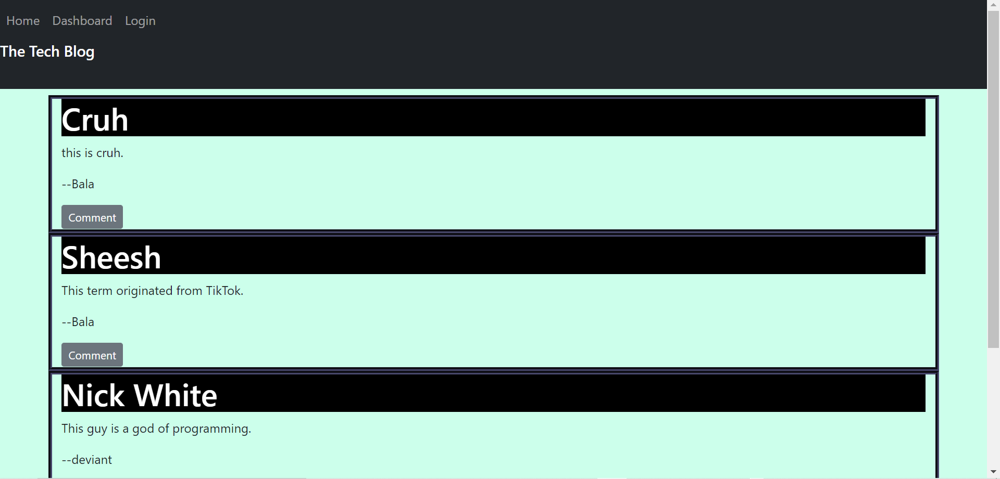

  # TechBlog

  
  

      

  ### Table of Contents
  [Description](https://github.com/DeviantSchemist/TechBlog#description)

  [Installation](https://github.com/DeviantSchemist/TechBlog#installation)

  [Usage](https://github.com/DeviantSchemist/TechBlog#usage)

  [Contribution](https://github.com/DeviantSchemist/TechBlog#contribution)

  [Tests](https://github.com/DeviantSchemist/TechBlog#tests)

  [Questions](https://github.com/DeviantSchemist/TechBlog#questions)

  ## Description
  A site where users can upload their experiences and thoughts surrounding the tech industry. Users are able to post and comment on other users' posts and make their own accounts.

  ## Installation
  Clone this repo and open it in your preferred IDE/text editor. Run the command "npm i" inside of your node.js enabled editor and it will install all of the dependencies for you.

  ## Usage
  After installing everything, run the command "nodemon" in order to start your local server connection at port 3000. Then you can open that port inside of Google Chrome in order to view the site. Or, view the deployed version on heroku.

  ## Contribution
  Clone this repo onto your local computer. Then make a new branch whose name is based on whatever feature you are working. After you have finished the implementation, submit a pull request for further review.

  ## Tests
  On the site, enter inputs that one might not otherwise think to enter. See if there are any bugs. If there are, do not hesitate to contact me using the information I have listed down below.

  ## Questions
  If you have additional questions, please see below for my contact information.

  ## Screenshot
  

  ## Contact Information

  Github: [deviantschemist](https://github.com/deviantschemist)

  Email: michaelngo1337@yahoo.com
  